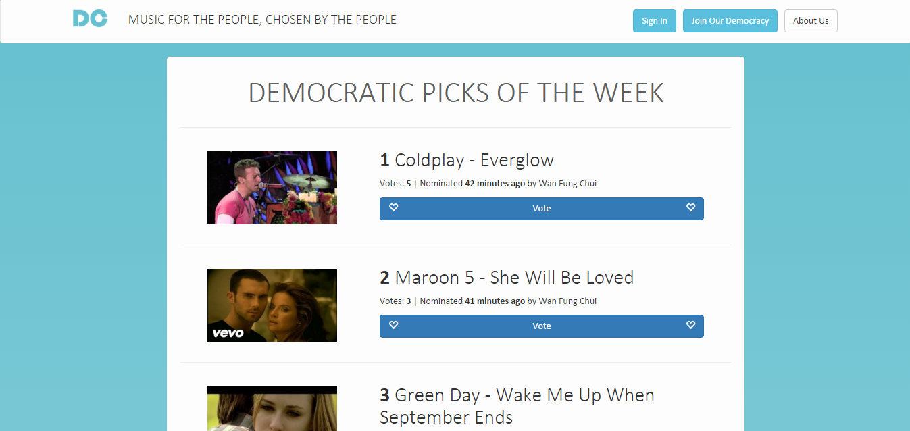

# Democratic-Charts
A user-voted music chart application implemented using Ruby on Rails and styled using Twitter Bootstrap.



The application accepts song nominations from logged-in users, who vote for songs nominated by other users. The songs are displayed in the homepage in descending order of votes, thus fulfilling the "democratic" specification of the chart. Users also have the ability to view the YouTube MVs of the song within the application, as well as post comments.

The Devise gem runs the user account capability, while acts_as_upvotable runs the voting system. Conventions such as REST and CRUD are followed for resources such as songs and users.

# Usage
You can check the heroku-hosted web application [here]().

Alternatively, to run the application locally, ensure you have the latest versions of Ruby and Rails installed. Then in the terminal run
```
$ git clone https://github.com/wanfungchui/Democratic-Charts
$ cd Democratic-Charts
$ rails server # (or simply use make)
```
The application should now be hosted [here](http://localhost:3000/).

# Credits

[Michael Hartl's legendary Rails tutorial](https://www.railstutorial.org/book) gave a thorough knowledge of Ruby on Rails, as well as Mackenzie Child's excellent Rails tutorials on YouTube.
